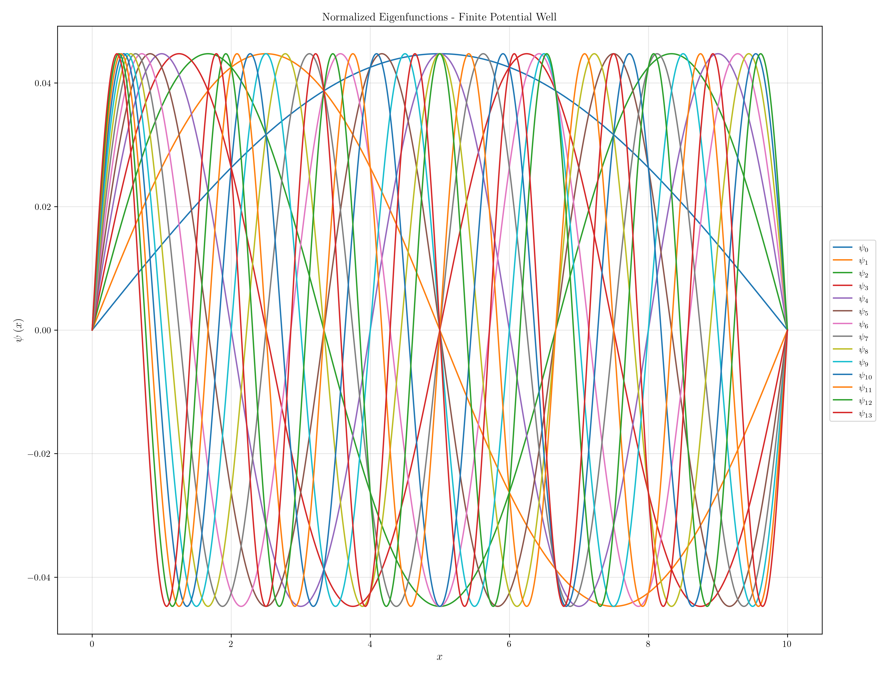
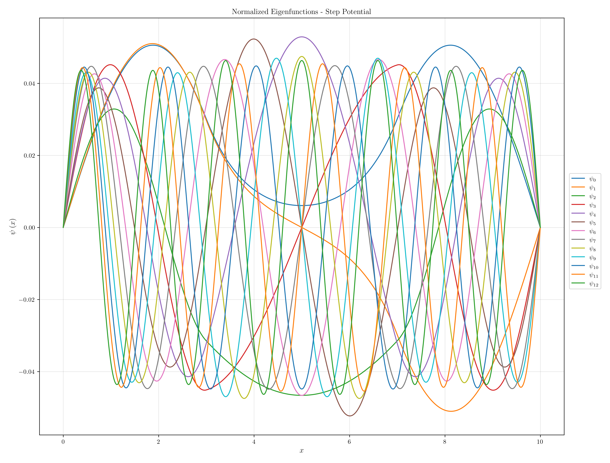
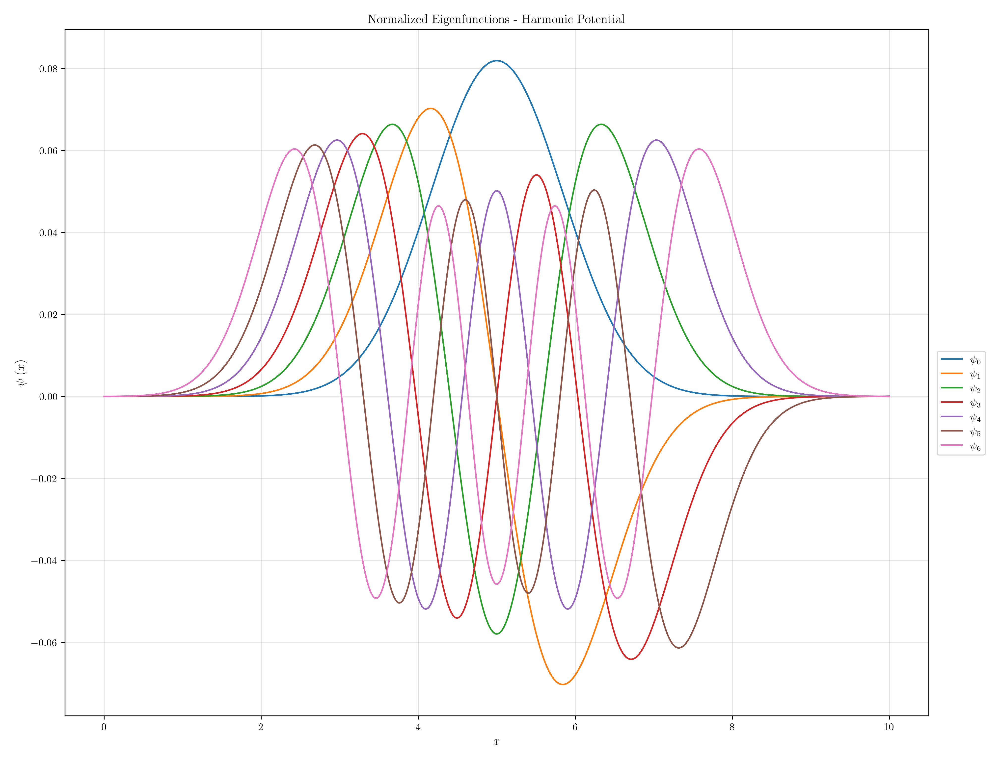
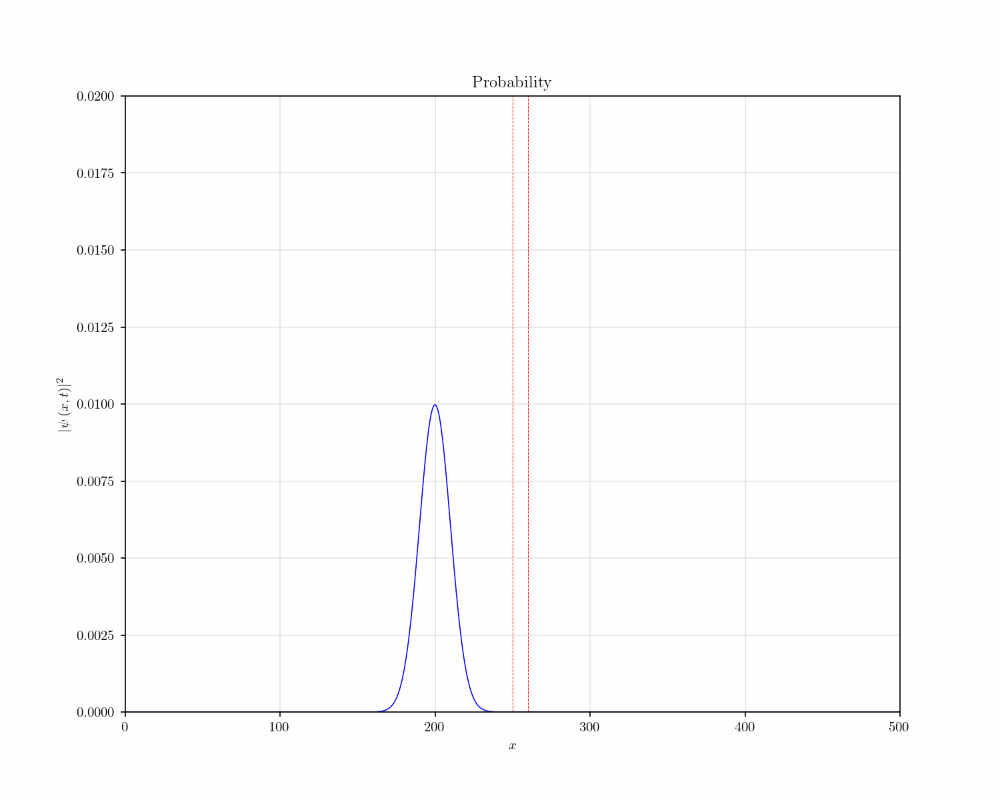
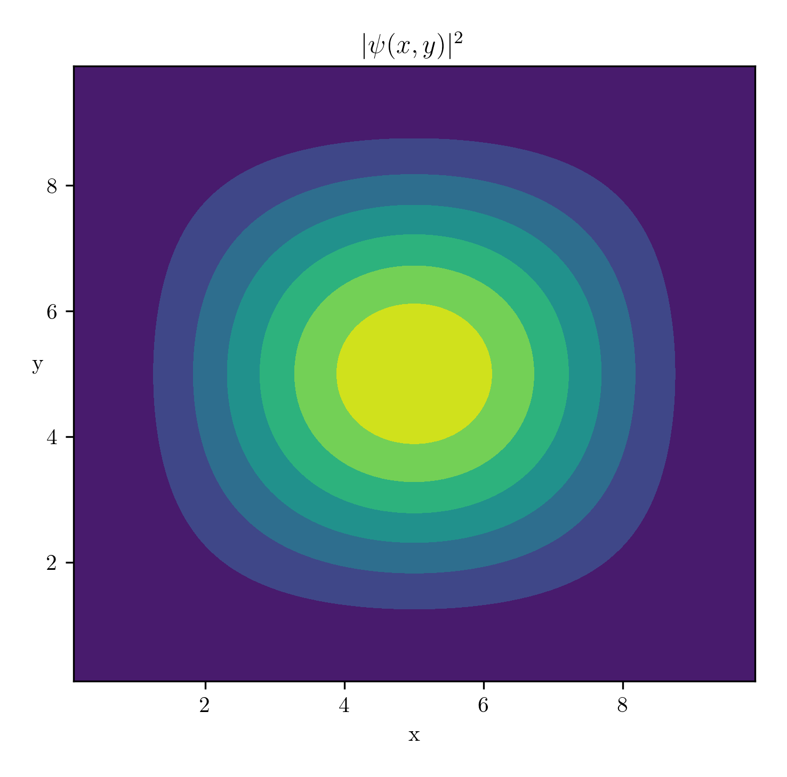
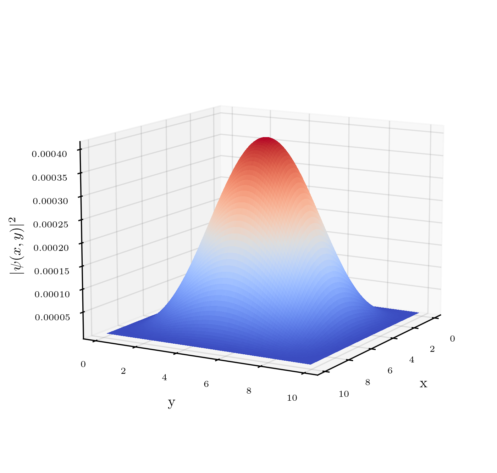
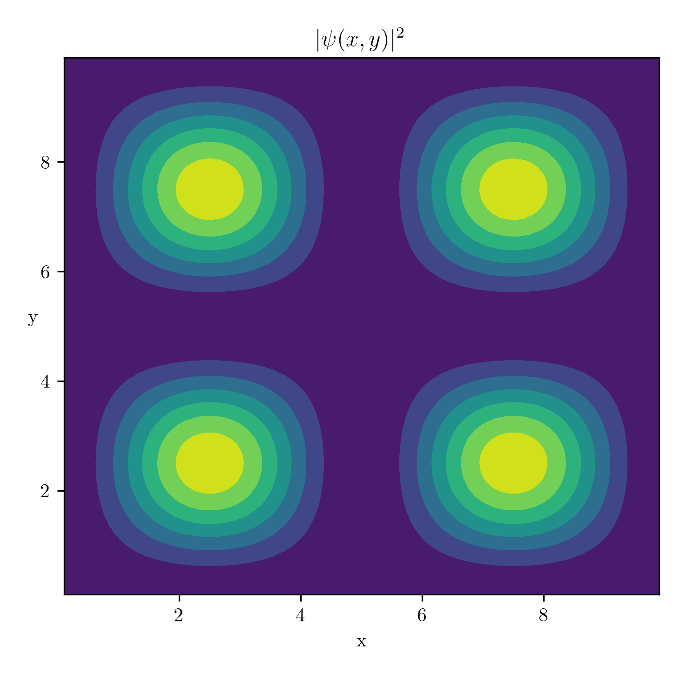
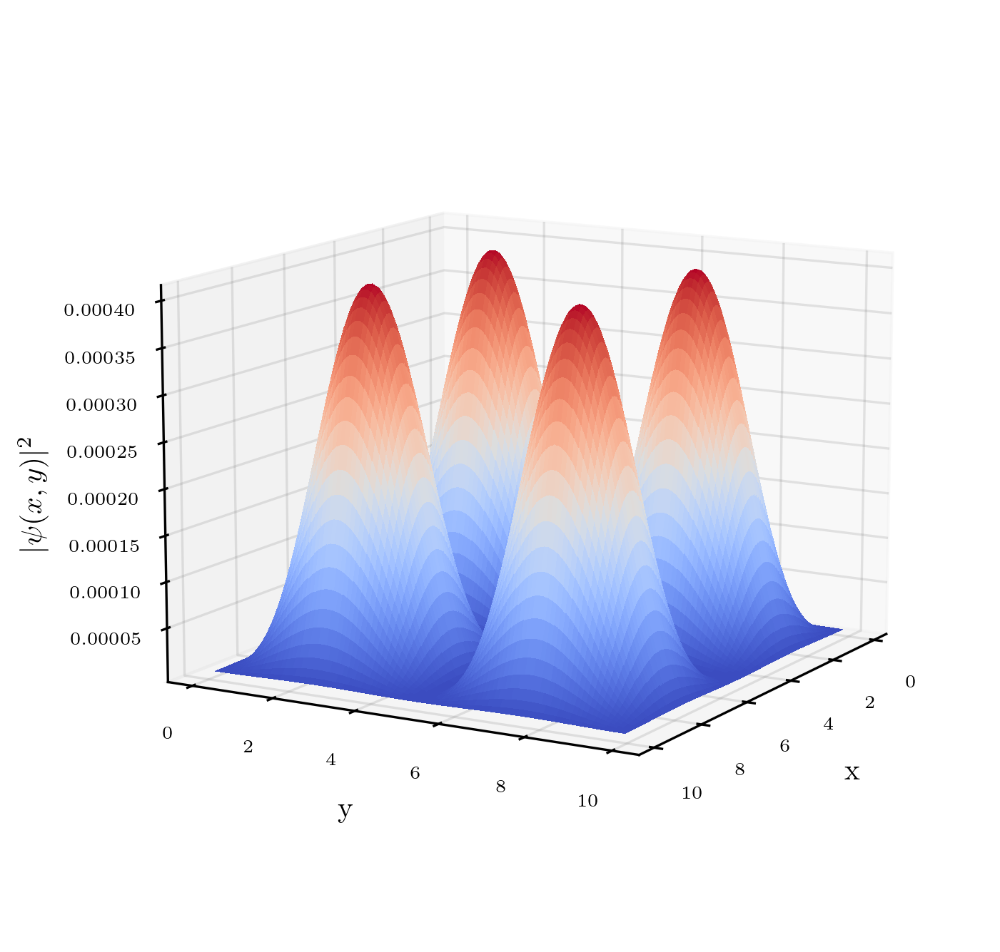
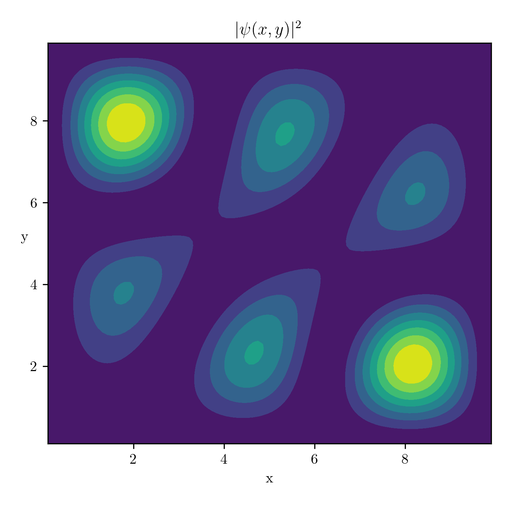
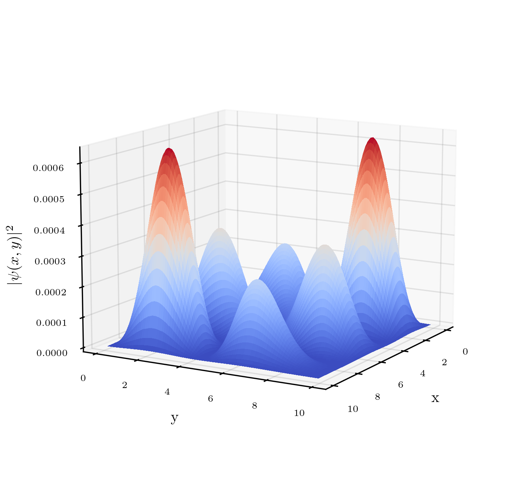

# Schrodinger Equation: Various Approaches
This repository aggregates various solutions to the time-dependent and time-independent Schrodinger equation, both 1D and 2D. More specifically, the Numerov propagator is used to find the first eigenvalues/eigenvectors of the stationary 1D equation for various potentials, the Crank-Nicolson propagator is applied to study the time evolution in case of a 1D potential barrier, and lastly an algebraic approach (using scipy's sparse matrices) is used to find eigenvalues and eigenvectors for the stationary 2D equation.

## Table of contents
1. [1D - Stationary](#1dstat)
2. [1D - Time Evolution](#1dtime)
3. [2D - Stationary](#2dstat)

## 1D - Stationary 
In `numerov.ipynb` the Numerov algorithm, a 4th order explicit propagator is used to solve the 1D stationary Schrodinger equation. The update rule, derived directly from the equation:
$$\left[-\frac{1}{2}\frac{d^2}{dx^2} + V(x)\right]\psi(x) = E\psi(x)$$
through a Taylor expansion, is the following:
$$y_i = \frac{(-10h^2(E-V_{i-1})+12)y_{i-1}-((E-V_{i-2})h^2+6)y_{i-2}}{6+(E-V_i)h^2}$$
where $h$ is the grid step and $V$ the potential. Three different potentials have been implemented: a finite well, a step potential and the harmonic potential. 

  
  
  

## 1D - Time Evolution 
In `crank_nicolson.ipynb` the solution to the 1D time-dependent Schrodinger equation is found numerically in presence of a potential barrier. The method employed is implicit and requires the definition of both the time evolution operator and an initial solution. This allows to display the time evolution of both the wave function and the probability density function:

  
   

## 2D - Stationary 
Lastly, in `sparse_matrix.ipynb` the 2D stationary Schrodinger equation is solved for an infinite square well using an implicit propagator. The Hamiltonian operator is defined and casted to a scipy's sparse matrix for better efficiency, then $\texttt{linalg.eigsh}$ is used to find the first eigenvalues and eigenvectors. Eigenvectors can be visualized both in 2D and 3D and they respect the expected behavior, except for occasional rotations due to numerical problems. 

- 1st eigenvalue (ground state)

  
   

- 4th eigenvalue

  
   

- 7th eigenvalue

  
   

